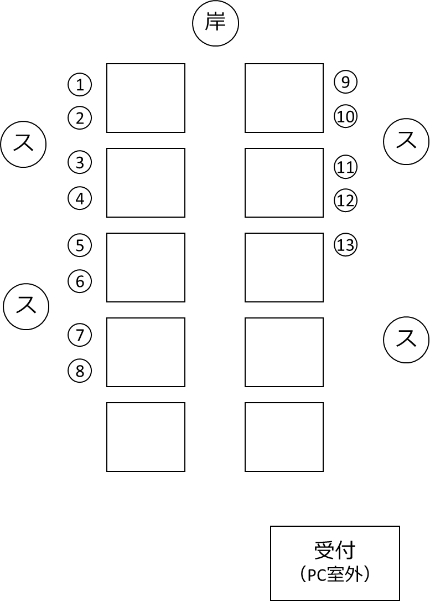

# 荏原平塚学園 プログラミング教室 スタッフ向けプリント👨‍🏫

最終更新 2022年9月1日 岸 嘉丸

## 昨年からの変更点

- 教室では、**児童のiPad**を使用して、SafariからScratch**オンラインエディター**を使用します。
- およそ**2週間に1回**のペースで開催します。
- 作るゲームを**1回につき1個**にしぼりました。代わりに、考える時間を多めに取ります。
- スタッフ向けプリントは初回のみ（これのみ）配布します。2回め以降は児童用プリントのみをお渡ししますので、内容をご確認ください。

## 開催概要

- 日時： 2022 年 9 月～12 月 土曜日（全6回）
- スタッフ集合 12:30、教室 13:00～15:00（120分）、終了後反省会
- 場所： 荏原平塚学園 3F パソコンルーム（メディアセンター奥）
- 参加児童： 荏原平塚学園 小学 5 年生の希望者 13 名（基本的に全回通じての参加）
- スタッフ：
メイン講師 岸嘉丸（荏原平塚学園卒業生）
卒業生の大学生・過去にプログラミング教室に参加した7年生
毎回スタッフ合計 4人想定
- 内容： Scratch（スクラッチ）を使用してのゲーム作成を通じたプログラミング

## 各回の内容

児童に見せる内容とは一部異なります。

### 第1回 9/10（土） 鬼ごっこゲーム

- スクラッチの使い方を知る
- 順次実行・条件分岐・ループのような基本構造にふれる
- キャラクターをタッチで動かす（動き・見た目）
- 敵に当たったことを判定する（イベント・音）

### 第2回 10/8（土） くだもの狩りゲーム

- キャラクターをキーボードで動かす
- キャラクターの場所を制御する（XY 座標）
- 敵やアイテムをたくさん出現させる（クローン・乱数）
- スコアをつける・タイムを計測する（変数）

### 第3 回 10/22（土） ジャンプゲーム

- XY 座標・クローン・変数の復習
- □色に触れたブロックを使う

### 第4 回 11/12（土） シューティングゲーム

- XY 座標・クローン・変数の復習

### 第5 回 11/26（土） 自分のゲームを作ろう

- （自分で考えたゲーム）
- このプログラムを動かすとどうなる？クイズ（検討中）
- うまく動かないプログラム、どう治す？クイズ（検討中）

### 第6 回 12/10（土） 発表会

- 作った作品を発表する

## 教室の目的

- スクラッチで記述されたアルゴリズムを理解できるようになる。
- 自分の発想をプログラミングによって実現できる能力（≒プログラミング的思考）を身につける。
- プログラミングを通じて、コンピューター・ゲームの中でどんなことが起こっているか知る。
- 他者の作品を見ること、自分の作品を他者に見せることで新たな発想を得る体験をする。
- プログラミングを楽しむ。

## 当日までにやってほしいこと

各回の児童用プリントの内容を、事前に Scratch を使用して作成するようお願いします。
ブラウザ上で、 Scratch を使用できます。
https://scratch.mit.edu/

## 当日の流れ

| 時刻 | タイトル | 内容 |
|-|-|-|
| -12:30 | スタッフ集合 | 直接 3 階 PC ルームへ。揃い次第、流れ・配置の確認をします。 |
||（初回のみ）名札書く | 来た人から名札を書きます。呼ばれたい名前で OK|
|13:00| 教室開始 |岸から導入・スタッフ挨拶|
|||プリントを進める|
|14:30| 自由に作る時間|プリントの内容終了後。時刻はあくまで目安。|
|14:55|アンケート配布| コーディネーター高田さんが配布・回収。|
|15:00| 教室終了| 忘れ物がないように！|
|児童帰り次第 |反省会| 次回に活かすため、教室中に気づいたことを伺います。|
|15:30| 解散||

## 教室中スタッフがやること
### 仕事
- 担当範囲の児童がプリントの内容を進められているかチェックする
- 操作や機能を説明する
  - 困ったときはメイン講師の岸や、他の講師を呼んでください
- 一緒に楽しむ

### やってほしいこと
- あいさつ
- 目線を合わせる
- 顔を見て話す
- 名札の名前を呼ぶ
- 一人一人の操作の様子をしばらく見続け、進んでいるか確認する
- 児童の質問に答える
- 質問のない児童に声をかける

### 言ってほしいこと
- 「迷ったら試してみよう」
- 「どうしてうまくいった？」
- 「どうしてうまくいかなかった？」
- 「どうしたらうまくいきそう？」
- 「書いたプログラムを（口に出して）読んでみよう」

※思考する行為を児童から奪わないようにしましょう（「ここが間違っているよ」「こうすればできるよ」という答えの提示はできるだけしない）。失敗することも教室の目的です。

## 座席配置

## その他

- iPadを忘れた児童がいる場合は、パソコンルームのWindowsを使ってもらいます。
