# 荏原平塚学園 プログラミング教室 第 1 回 オニごっこゲームをつくろう

2022 年 9 月 10 日 岸 嘉丸

## この教室でやること

- 見本をマネしながら **プログラミングの練習** をする。
- 自分で考えて **自分のゲーム** を作る 。
- 作った作品を他の人に見せる。最終回は **発表会** を行います！

## 年間スケジュール

第1回 9/10（土） オニごっこゲーム
第2回 10/8（土） くだもの狩りゲーム
第3回 10/22（土） アクションゲーム
第4回 11/12（土） シューティングゲーム
第5回 11/26（土） 自分のゲームを作ろう
第6回 12/10（土） 発表会

## 教室の進め方

- 毎回プリントを配ります。
  - プログラミングをするとき、計算をしたり、順序を考えたりすることがあります。
考えたことをどんどんプリントにメモしましょう。
  - 家に持って帰って、お家の人にもどんなことをしたか話してあげてください。
  - 前回までのプリントを持ってきて参考にしても構いません。
- 説明の間は静かに聞きましょう。
- 早く終わった人は周りの人の質問に答えてあげましょう。

## 心得

1. どうなるかわからないときは、たくさん試してみよう！ たくさん失敗しよう！
2. マネするだけではなく、「どうして動く？」や「変えてみたらどうなる？」を考えよう！
3. わからないことがあるときは、周りの友達や、スタッフさんに質問しよう！

## 考え方のコツ

1. 「小さく分けて考える」
2. 「頭の中で動かしてみる」
3. 「大事なところを見つけ出す」

---

## プログラミングって？
コンピューターに指示をする命令を作ることをプログラミングと言います。
この教室では、Scratch（スクラッチ）というソフトを使ってプログラミングをします。

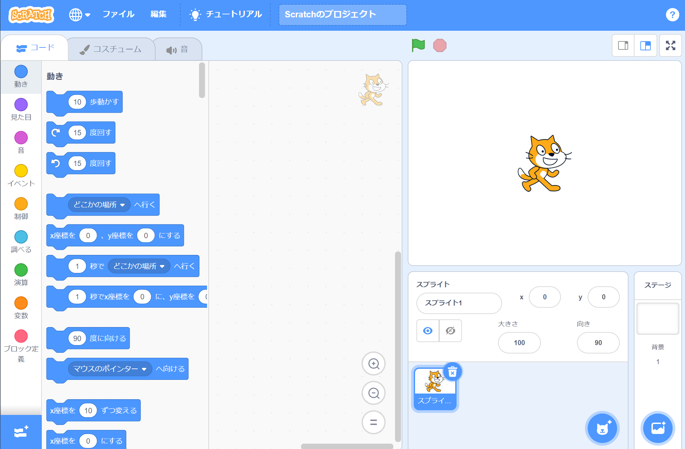

## スクラッチの使い方

iPad（アイパッド）のカメラでQRコードを撮影して、Safari（サファリ）でスクラッチを開きましょう。

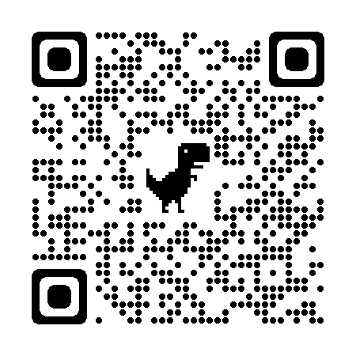

https://scratch.mit.edu/projects/editor/

## ブロック

画面の左側に並んでいる、色のついたパーツを **「ブロック」** と言います。

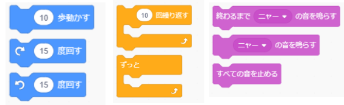

ブロックには、画面にいるキャラクターに与える**命令**が書いてあります。

## れんしゅう 1 命令を出そう

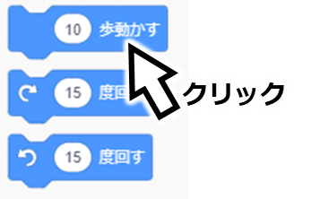
 

次の３種類のブロックを探してクリックして、ネコを動かしてみましょう。

#### 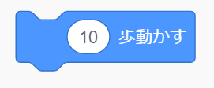
#### 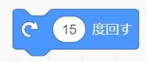
#### 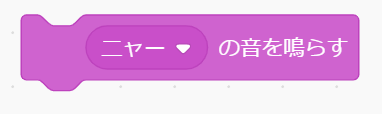

## プログラム（スクリプト）

ブロックをつなげて **「プログラム」** を作ります。
スクラッチでは **「スクリプト」** や **「コード」** とも言います。
スクラッチは、ブロックに書いてあることを、書いてある順番に、続けて実行します。

## れんしゅう 2 ネコを歩かせよう
下に書いてあるプログラムを作って、ネコを歩かせましょう。

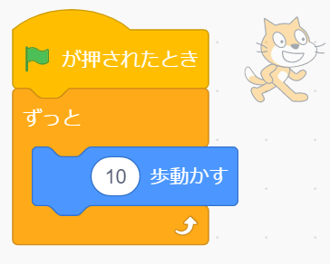

完成したら、  をクリックしてスタート！

ネコが画面からいなくなっちゃったときは、ネコをドラッグして真ん中に戻しましょう。
全く見えなくなっていたら、 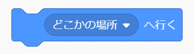 をクリックして、動かしましょう。

## れんしゅう 3 いろいろ試してみよう

#### 「もし端に着いたら、跳ね返る」
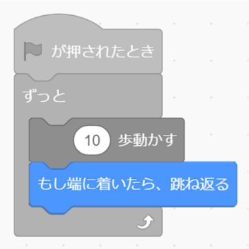

#### 「回転方法を左右のみにする」
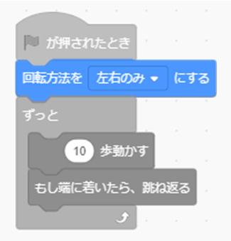

#### 「○歩動かす」の数字を変える
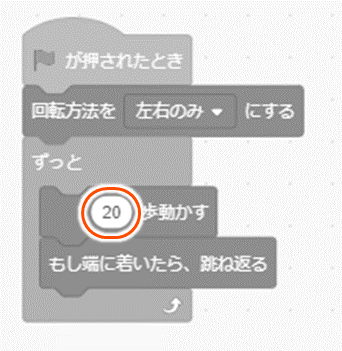

#### 「○度回す」 
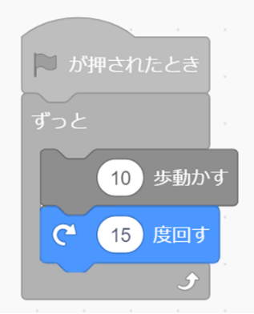

#### 「次のコスチュームにする」
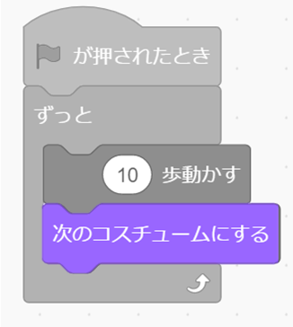

#### 「○秒待つ」
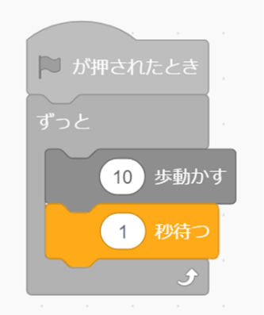

## ファイルの保存

作ったプログラムを保存しないと、作ったデータが消えてしまいます。
1つのプログラムを、1つの「ファイル」として保存します。

## れんしゅう 5 つくったプログラムを保存しよう

れんしゅう 4 が終わったら、プログラムを**保存**します。

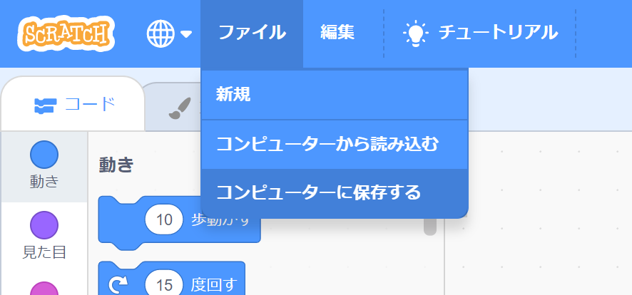

名前を変える場合は、一度ホームに戻って、「ファイル」→「ダウンロード」→「Scratchプロジェクト」のファイルの名前を変更します。
ファイルには、どんなプログラムかわかりやすい名前（たとえば今回なら、「歩くネコ」など）をつけましょう。

---

## れんしゅう 6 オニごっこゲームを作ろう
サメから逃げながら、星を取るゲームを作ります。

### 小さく分けよう
まずは、このゲームを作るために必要なものを分解しましょう。

- タッチでネコを動かす。
- サメがネコを追いかける。
- ネコがサメに当たったらゲームオーバーにする。
- 星を取ったらクリアする。

### タッチでネコを動かす

#### これまでに作ったプログラムを保存したことを確認して、 「ファイル」→「新規」で新しいプログラムを作る。

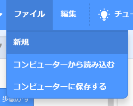

#### ネコの大きさを小さくしておく
ネコのスプライトをクリックして、「大きさ」の数字を「70」にしましょう。

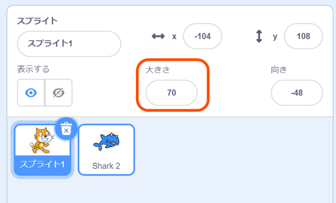

#### このプログラムを動かすとどうなるか、まずは頭の中で動かしてみよう

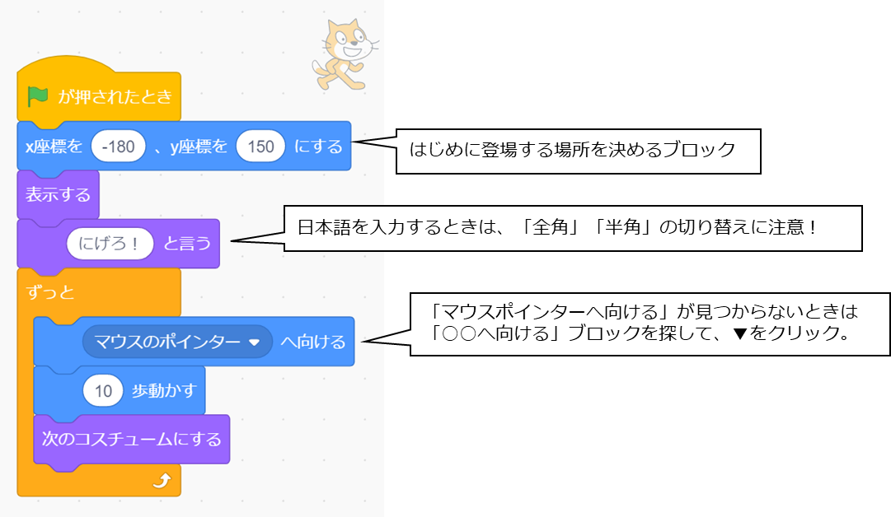

#### 上のプログラムをつくろう

####  をクリックして、ネコがタッチにくっついて動くことを確認する。

遊ぶときは 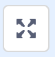 を押して、全画面にして遊ぼう
（そうしないと、タッチ操作がドラッグ操作になってしまうため）

うまくいかないときは、プログラムを直そう。
うまくできていたら次に進みます。

## スプライト
画面の中で動かす絵のことを **「スプライト」** と言います。
スプライトごとに別々のプログラムを作ります。

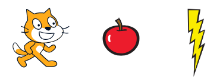

### サメがネコを追いかける ・ネコがサメに当たったらゲームオーバーにする

#### 右下のスプライト追加ボタンをクリック。

#### サメ 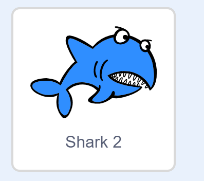 を探してクリック。

#### サメ をクリックして、サメ（Shark2）のプログラムを作る。

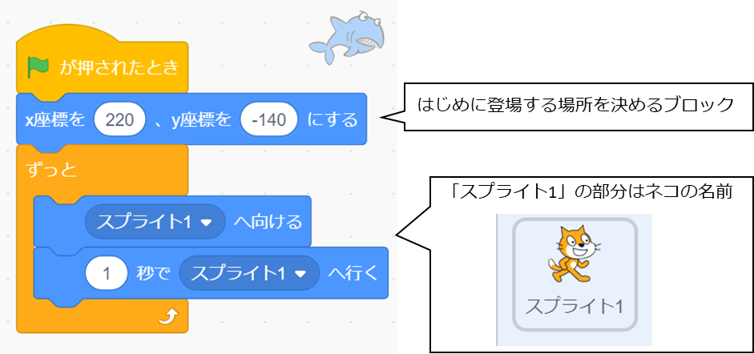

#### 旗をクリックしてゲームをスタートして、サメがネコに向かって動いているか確認する。
うまくいかないときは、プログラムを直そう。
うまくいったら次に進もう。

#### ネコがサメに当たったらゲームが終わるように、ネコのプログラムを追加する
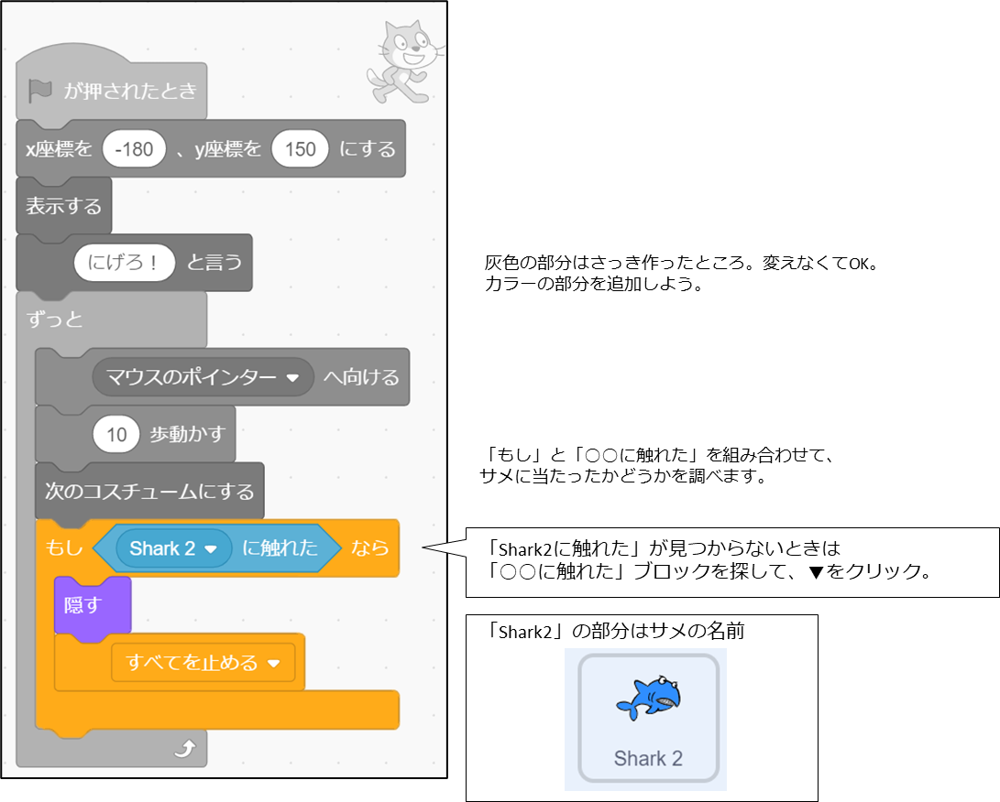

#### 旗をクリックして、サメに当たったらゲームが終了するか確認する。

### 星を取ったらクリアする

#### サメのときと同じように、右下のスプライト追加ボタンをクリック。

#### 星 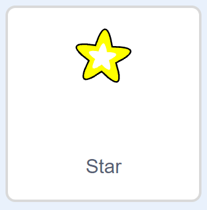 を探してクリック。

#### ネコのプログラムを追加する。

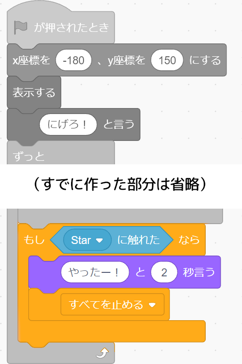

#### 旗をクリックして、星にあたったら「やったー！」を言った後にゲームが終了するか確認する。

### 背景を変える

この背景は「Underwater2」という名前です。

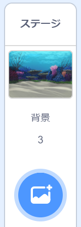
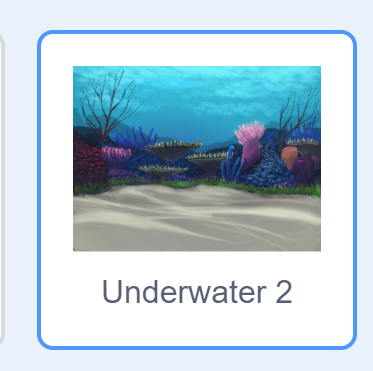

## メッセージ
「メッセージ」は、他のスプライトに命令を送るための機能です。
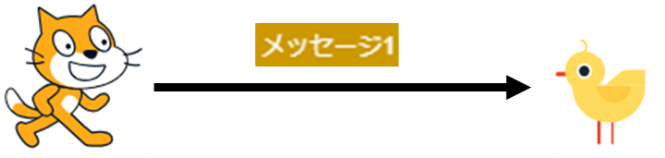

### ゲームオーバー演出を追加しよう
サメに食べられたとき、音を鳴らしたり、「ゲームオーバー」の文字を出したりしてみましょう。
#### メッセージ 1 の横の▼をクリック、「新しいメッセージ」をクリックして、「ゲームオーバー」のメッセージを作成します。

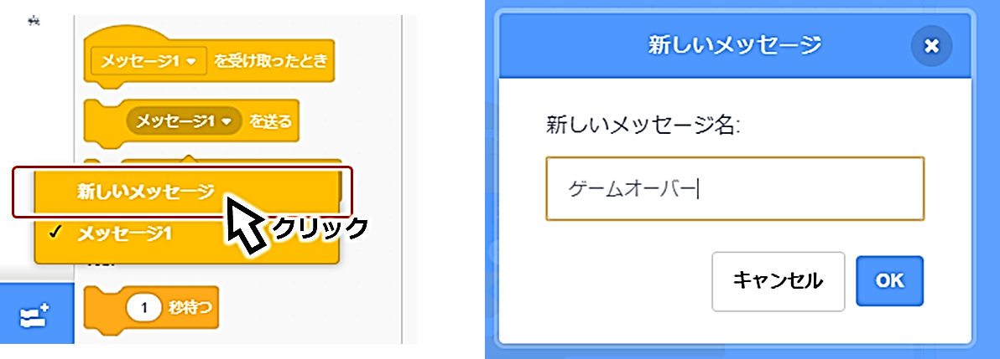
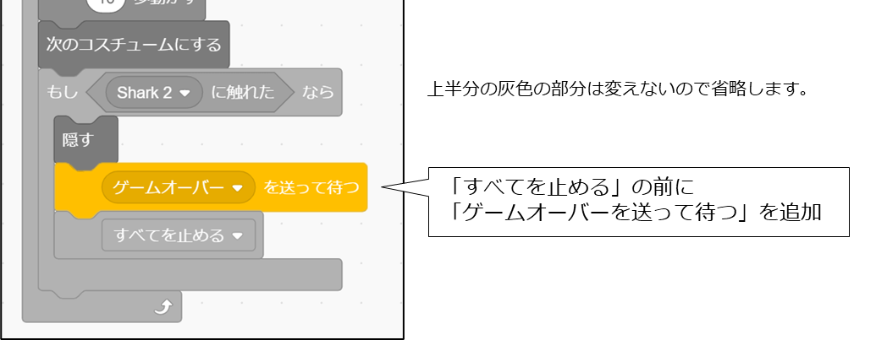
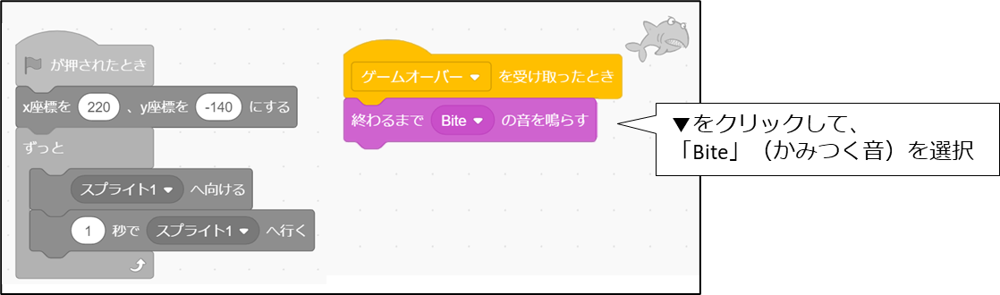

#### ネコに、ゲームオーバーのメッセージを送るプログラムを追加します。
#### サメのプログラムに、ゲームオーバーのとき音を鳴らすプログラムを追加します。
#### 旗をクリックしてゲームをスタートして、ゲームオーバーのとき音がなるか確かめる。

#### ゲームオーバーの文字を描く

スプライトの「描く」をクリックして、手書きする。

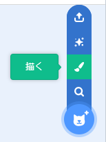
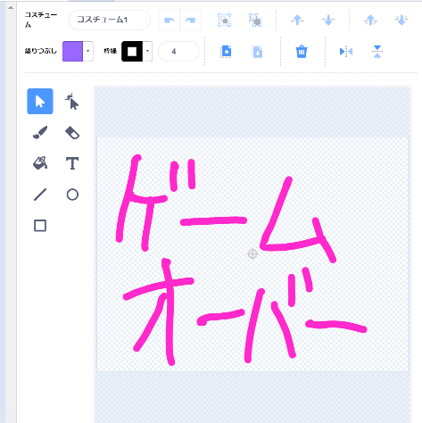

#### ゲームオーバーの文字のプログラムを作る

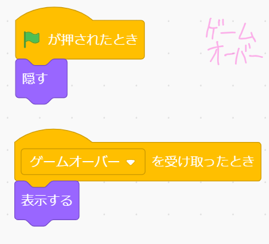

#### 旗をクリックしてゲームをスタートして、ゲームオーバーが出るか確認する。
完成！

## つくったプログラムを保存しよう
終わったら、手を上げてスタッフを呼んで、プログラムを保存します。

## ゲームを改良してみよう

例えば・・

- 敵の速さを変える
- ネコの速さを変える
- 敵を増やす
- ゲームオーバーを参考にして、ゲームクリアを作る

その他にもやってみたいことがあればやってみよう。

「大事なものを見つけ出す」
どこを変えたらいいんだろう？
動く速さを変えたいから、「動き」に関係あるところを探せばいいんだな。
動きは青いブロックだ。

## 次回の予定
第2 回 10/9（土）
iPadの充電を忘れずに、来てください。

## 参考サイト
プログラムの参考を探したいとき
「Ｗｈｙ！？プログラミング | NHK for School」
https://www.nhk.or.jp/school/sougou/programming/

https://www.nhk.or.jp/school/sougou/texico/

スクラッチの使い方を調べたいとき
「Japanese Scratch-Wiki」
https://ja.scratch-wiki.info/wiki/