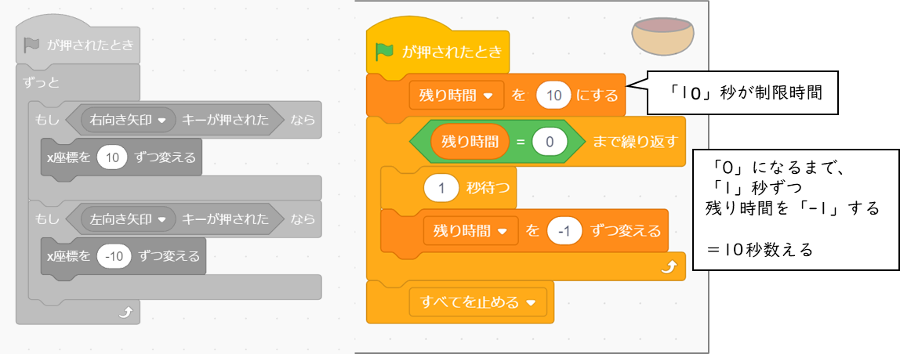

# プログラミング教室 第 2 回 くだもの拾いゲームをつくろう

2022年 10月 8日 岸 嘉丸

## 心得

1. どうなるかわからないときは、たくさん試してみよう！ たくさん失敗しよう！
2. マネするだけではなく、「どうして動く？」や「変えてみたらどうなる？」を考えよう！
3. わからないことがあるときは、周りの友達や、スタッフさんに質問しよう！

## くだもの拾いゲームを作ろう
落ちてくるくだもの（りんご）を拾うゲームを作ります。

### 小さく分けて考える

- プレイヤー（ボウル）を左右に動かす。
- くだもの（例：りんご）を、上から落とす。
- プレイヤーがくだものに当たると、スコアを加算する。
- 制限時間をつけて、時間切れになるとゲームを終了する。

---

<!-- マウス操作も検討したが、キーボード操作のほうが移動の実装がシンプルなのでキーボードで。 -->
<!-- ## 「○○キーが押された」ブロック
キーボードで操作するときは、 **「○○キーが押された」** ブロックを使います。

 -->

## xy座標（エックス・ワイざひょう）
座標（ざひょう）とは、画面の中の場所を、数字で表す方法のことです。
横（よこ）の位置を x（エックス）座標、縦（たて）の位置を y（ワイ）座標で表します。

スプライトの座標は、スプライトの名前の横に表示されています。

背景から「xy-grid」を選ぶと、背景に座標軸を表示できます。

---

### プレイヤーを動かす

<!-- 新規作成する。 -->
<!--  -->

#### ボウルのスプライトを追加する。

#### ネコは使わないので削除する。
#### ボウル  をプログラムして、横に動くようにする。

####  をクリックして、キーボードで動かせることを確認する。
うまくいかないときは、プログラムを直そう。うまくできていたら次に進みます。

### x軸（横の動き）

---

## クローン
クローンは、分身をつくる機能で、おなじスプライトをたくさん表示させたいときに使います。

## リンゴを落とす

#### リンゴのスプライトを追加する

#### リンゴの大きさを 60 くらいにして、リンゴを小さくする。

---

#### リンゴ  をプログラムして、ランダムな場所から落ちてくるようにする。

####  このプログラムを動かすとどうなるか、まずは頭の中で動かしてみよう

<!-- りんごの動きをシミュレーションさせる -->
頭の中で動かしてみる リンゴがどんな風に動くのかシミュレーションしよう。

####  をクリックして、リンゴがランダムな場所から落ちることをたしかめる。

---

## 変数（へんすう）
変数（へんすう）とは、「変更できる数」のことです。
例えば、ゲームのスコアを記録したり、HP を設定したりできます。

## 変数の使い方
### 変数を作る
「変数を作る」をクリックして、変数の名前を入力します。

### 変数の値を表示する / 非表示にする

変数名の左の四角（チェックボックス）をクリックすると、ステージに変数の値を表示する
か、非表示にするかを切り替えることができます。

---

## スコアを記録する
#### 「スコア」の変数を作る

####  リンゴをひろうとスコアが増えるように、リンゴのプログラムを変更する。

####  をクリックして、リンゴがボウルにふれるとスコアが増えることをたしかめる。

---

## 制限時間をつける
####  「残り時間」の変数を作る。作り方はスコアと同じ。

####  ボウルに残り時間を計測するプログラム

<!-- 時間計測をシミュレーションさせる -->

頭の中で動かしてみる 残り時間がどう変わるのかシミュレーションしよう。

#### プログラムを作る

####  をクリックして、時間がたったらゲームが終わることをたしかめる。

---

## 背景を設定する

**完成！**

##  つくったプログラムを保存しよう
プログラムを保存します。

## 発展　一番下まで落ちたリンゴを消す

リンゴのコードを改良して、下に落ちたリンゴが消えるようにしよう。

---

## 発展　スコアが減るアイテムを作ろう

#### 新しいスプライトを追加する（例：カミナリ  。他でもOK）

#### リンゴのコードをコピーする（コードをドラッグして、新しいスプライトの上でドロップ）

#### 当たったときにスコアがへるように、コードを直す

大事なところを見つけ出す スコアをへらすためには、どこを変えればいいだろう？　今スコアを増やしているのは、どの命令かな？　考えてみよう

#### その他、落ちるスピードや、出てくる個数を調整する。

## 改良のヒント

- **リンゴが落ちるまでの時間をランダムにする**
- **スコアが増えるほど、ボウルの動きが遅くなるようにする**

## 他の人に自分の作品を見せよう
一人ずつ、自分の作品を紹介しましょう。どんなところを工夫したか、なにがまだできていないのかなどを説明してください。

## 次回

次回は **アクションゲーム** を作ります！　iPadの充電を忘れずにして、来てください。