# 荏原平塚学園 プログラミング教室 第 3 回 アクションゲームをつくろう

2022年 10月 22日 岸 嘉丸

## 心得

1. どうなるかわからないときは、たくさん試してみよう！ たくさん失敗しよう！
2. マネするだけではなく、「どうして動く？」や「変えてみたらどうなる？」を考えよう！
3. わからないことがあるときは、周りの友達や、スタッフさんに質問しよう！

## アクションゲームを作る

移動・ジャンプ・攻撃をしながら、相手を倒すゲームを作ります。

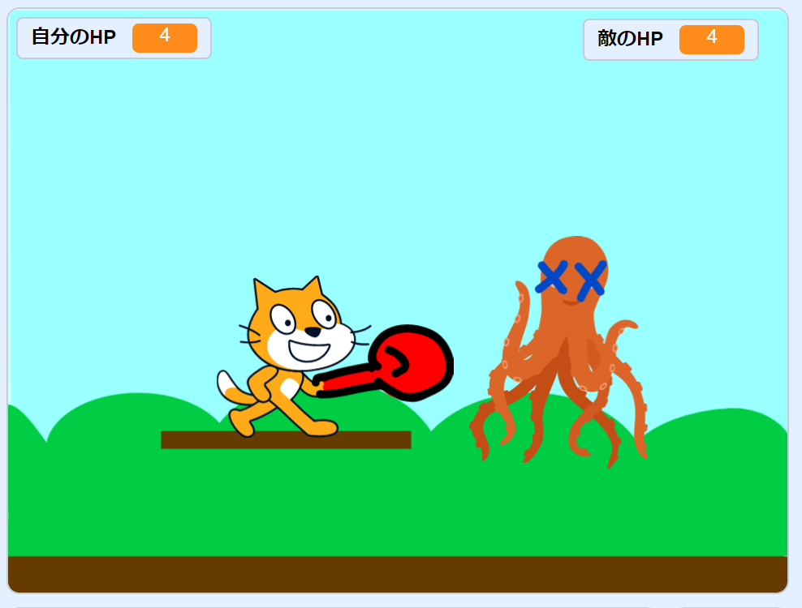

### 小さく分けて考える

- プレイヤーを左右に動かす
- プレイヤーをジャンプさせる・落下させる
- 敵を動かす
- プレイヤーが敵に当たったらダメージを受ける（自分のHPが減る）
- プレイヤーが敵を攻撃できる（敵のHPが減る）
- ゲームクリア・ゲームオーバーの表示をする

---

## プレイヤーを左右に動かす

#### （ネコ以外のスプライトを使う場合は）プレイヤーのスプライトを追加する

#### 左右矢印キー（「←」「→」）を押したときに左右に動くようにプログラムを作る

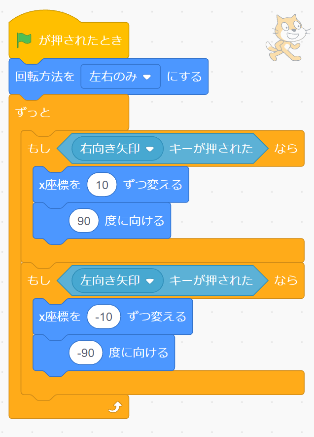

####  をクリックして、左右矢印キー（「←」「→」）を押したときにプレイヤーが動くか確認する。 動くだけでなく、向きもしっかり左右を向いているかチェック！

## 発展 移動スピードを変えてみよう

大事なところを見つけ出す
矢印キーを押したときに動くスピードを変えるにはどの数字を変えたらいいだろう？
動くスピードを速くしたり遅くしたりしてみよう。

---

## 「◯色に触れた」ブロック

選択した色に触れているかどうかを調べることができるブロック。
今回は、地面に触れているかどうかを調べるのに使います。

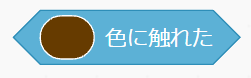

使うときは、「スポイト」機能を使って、同じ色を選択します。

## プレイヤーをジャンプさせる・落下させる

#### 背景を設定する

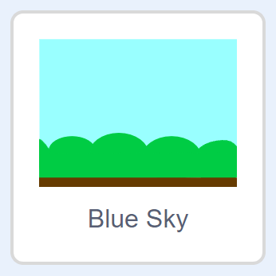

ここでは、 **地面が1色になっていること** が重要です。
もし違う背景を選ぶ場合は、地面を1色で平らに塗りつぶしましょう。

---

#### プログラムをシミュレーションする

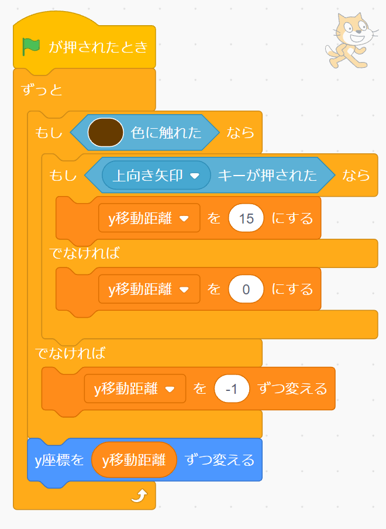

頭の中で動かしてみる ジャンプがどんな風に動くのかシミュレーションしよう。

#### プログラムを作る

####  を押して、ジャンプできるか確認する。

---

## 敵を追加して、動かす

#### 敵のスプライト（例：タコ 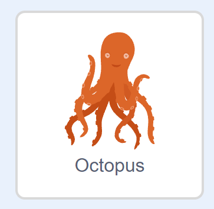 ）を追加する

#### 敵の動きをつける

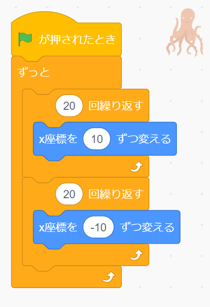

## 発展 敵の動きを変えてみよう

動くスピード・動き方を変えてみよう。
見本では横にだけ動いているけど、縦に動かすにはどうすればいいだろう？

---

## 敵に当たったらダメージを受けるようにする

#### 「ダメージ」状態のコスチュームを描く

コスチュームを右クリック（長押し）して、「複製（ふくせい）」して作ろう。
ダメージを受けたことがわかる見た目にしよう。

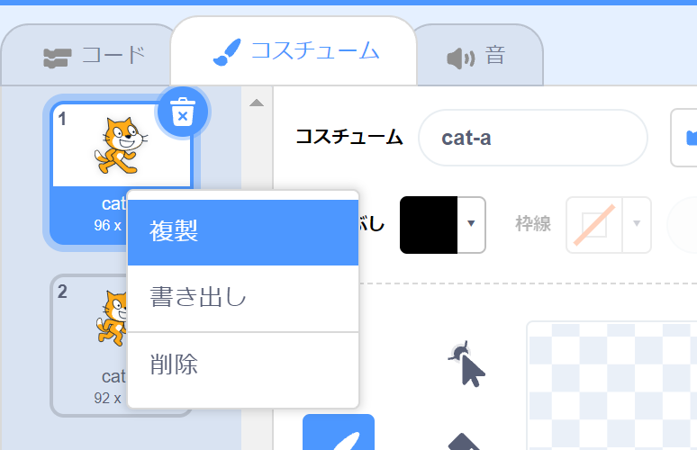
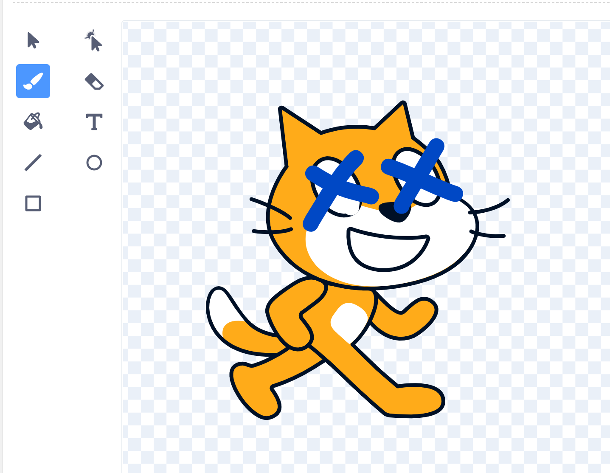

#### コスチュームの名前をそれぞれ「つうじょう」「ダメージ」に変更する
このあとプログラムを作るときに、この名前を使うよ。

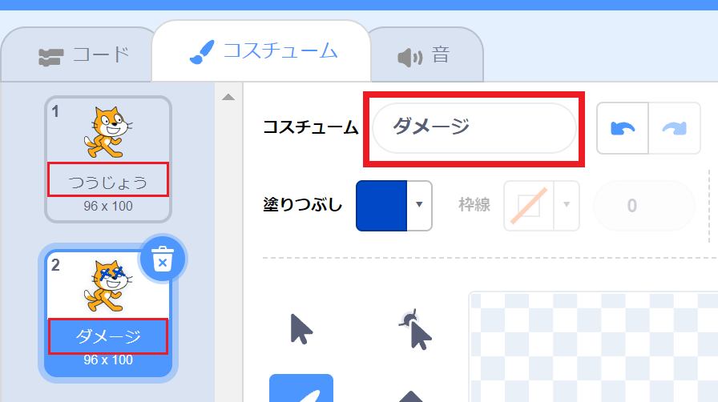

---

#### 頭の中で動かしてみる プログラムをシミュレーションする

<!-- = つうじょうの判定がないとどうなる？を考えさせたい・・・ -->

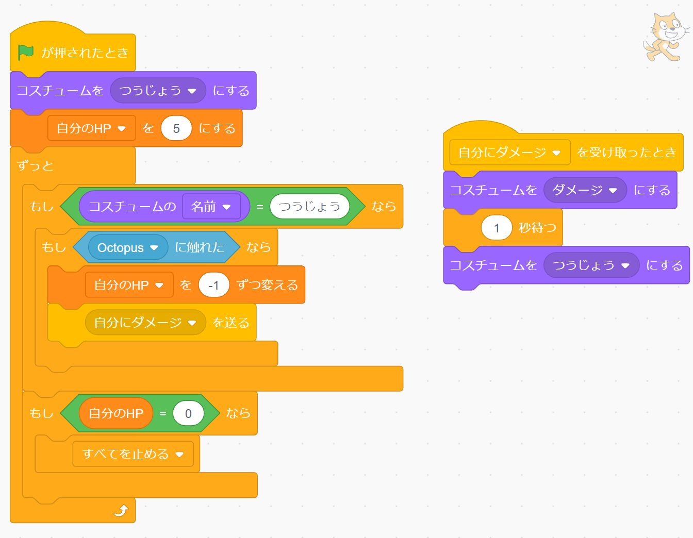

---

#### プログラムを作る

「自分にダメージ」はメッセージを追加、「自分のHP」は変数を追加する。

#### 旗  をクリックして、敵に当たったらダメージを受けるか確かめる。

## 発展 ダメージを受けたときの演出をつけてみよう

ダメージを受けたときに、プレイヤーをチカチカと点滅させてみよう。
ダメージを受けたことがわかりやすくなるよ。

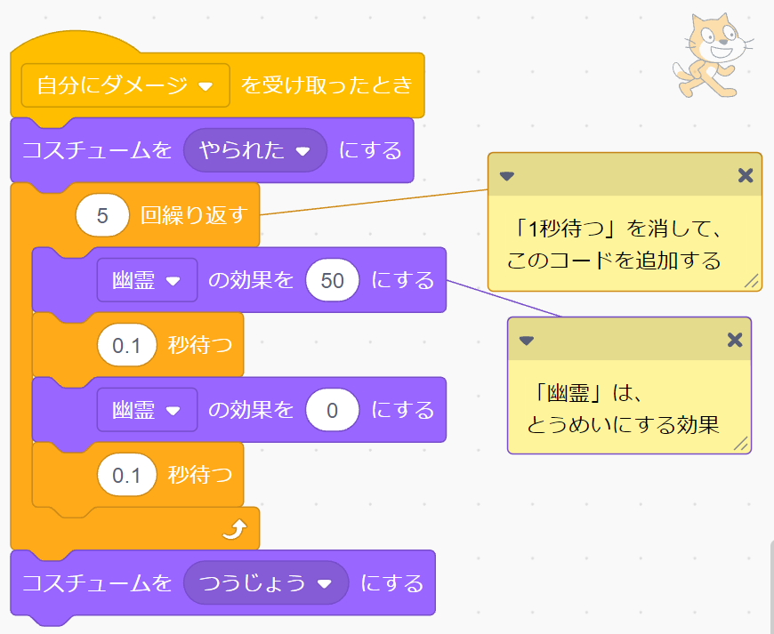

---

## 攻撃して、敵にダメージを与えられるようにする
#### プレイヤーの「こうげき」状態のコスチュームを描く

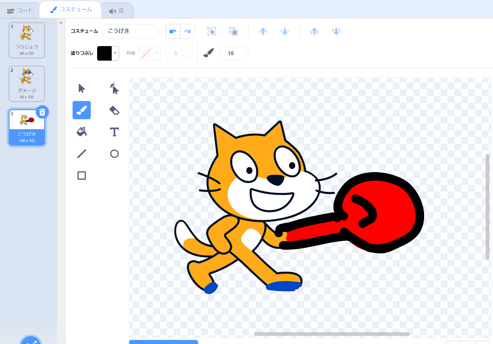

#### 描いたコスチュームの名前を「こうげき」にする

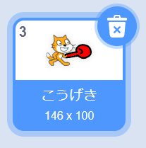

#### 敵の「ダメージ」状態のコスチュームを描く

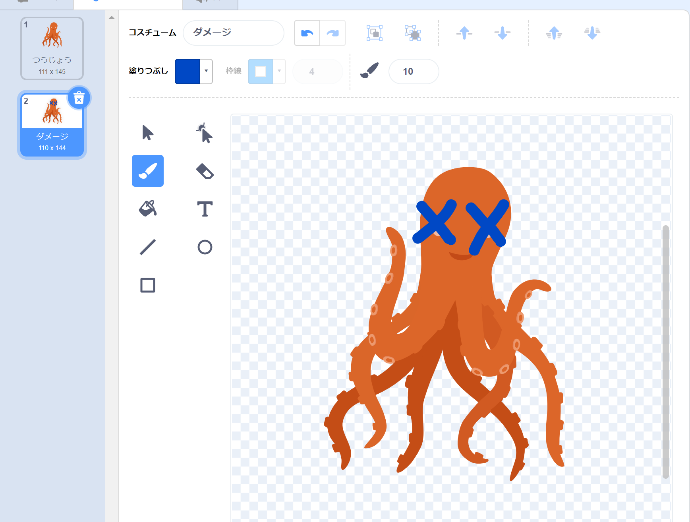

#### コスチュームの名前をそれぞれ「つうじょう」「ダメージ」にする

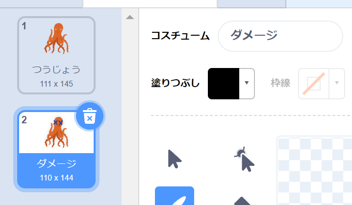

---

#### プログラムを作る

**プレイヤーのプログラム**

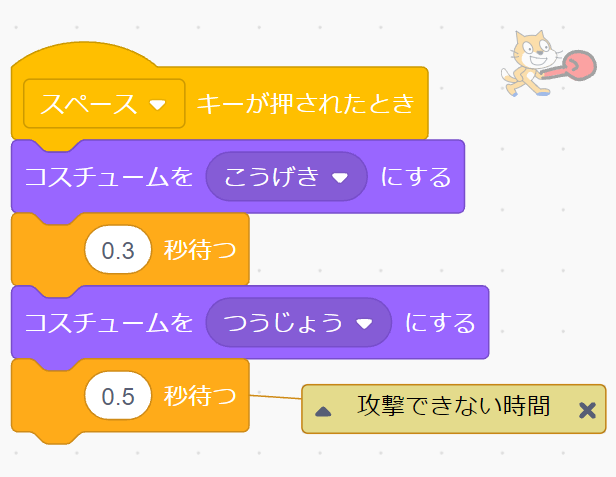

**敵のプログラム**

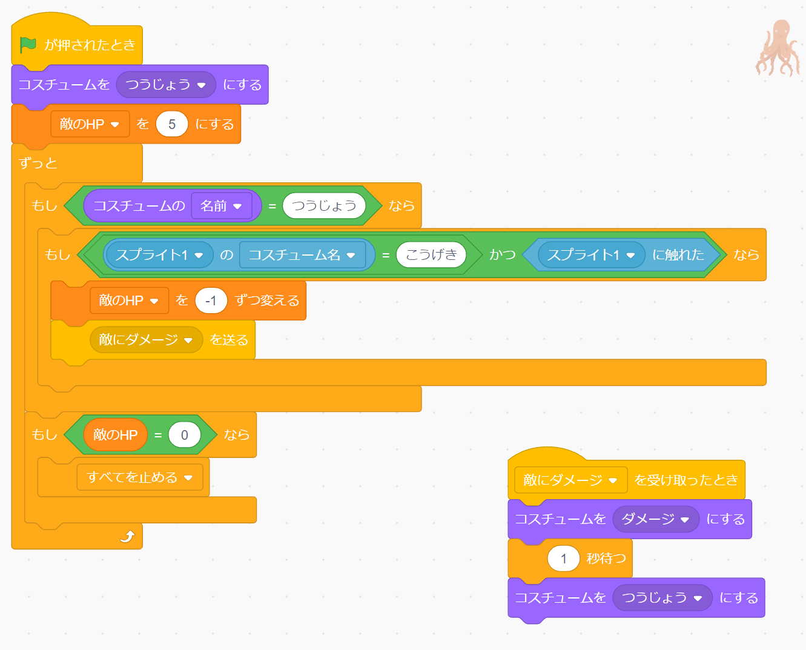

####  をクリックして、攻撃してダメージを与えられるか確認する。

---

## 「勝ち」（ゲームクリア）画面を作ろう

#### 「勝ち」を表示するスプライトを描く

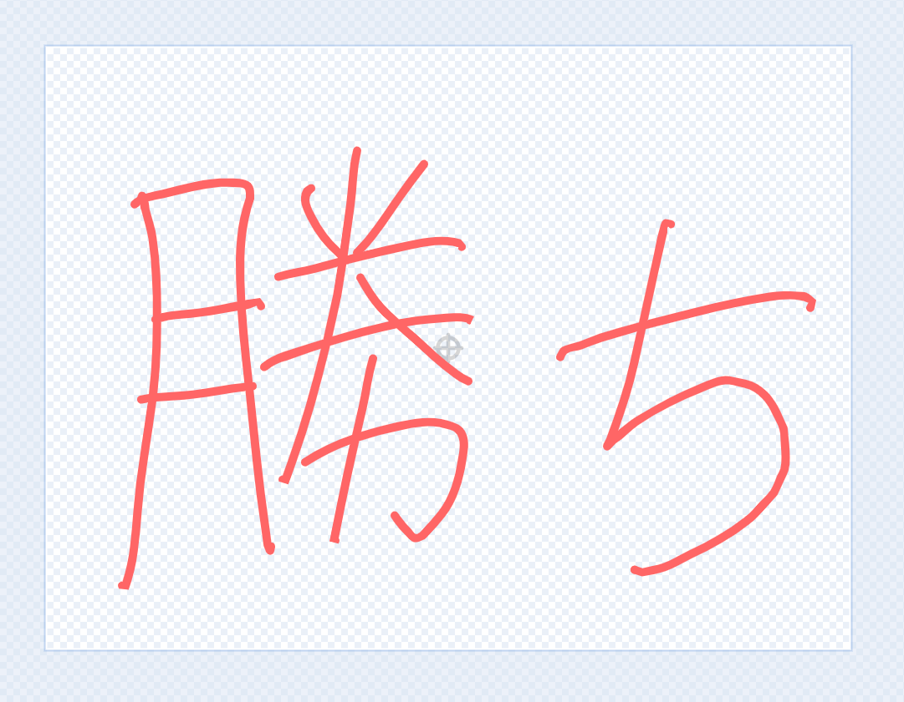

#### 敵のHPがなくなったときに、「勝ち」を表示するように、プログラムを作る

**敵のプログラム**

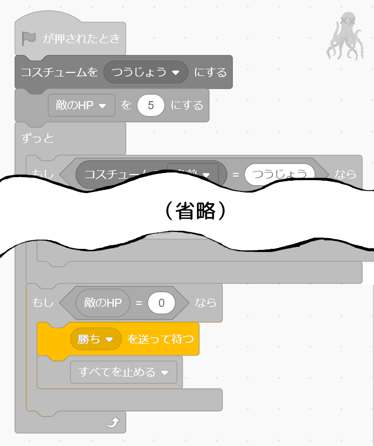

**「勝ち」のプログラム**

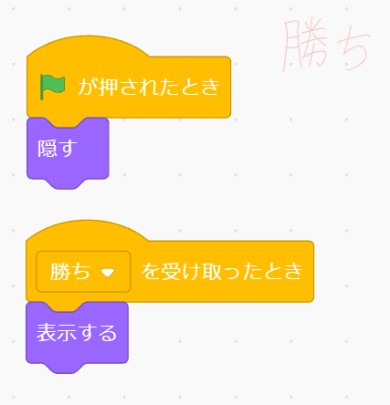

#### 完成！　保存しよう

## 発展　「負け」（ゲームオーバー）画面を作ろう

「勝ち」画面を作ったのを参考に、**自分のHPがなくなったとき** に **「負け」** の画面を表示するようにしてみよう。

---

## 発展 ステージに足場を追加しよう

背景に **地面と同じ色で** 足場を追加して、着地できる場所を増やしてみよう。

## 発展 無敵状態になるアイテムを作ろう

#### アイテム（星 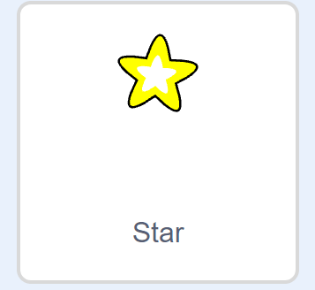）を追加する

####  アイテムを取ったあと無敵状態になるようにプログラムを変える

無敵状態のときは、敵にダメージを与えられるように、「こうげき」のコスチュームにする。
「色」の効果を使って、虹色に光るような見た目にしよう。

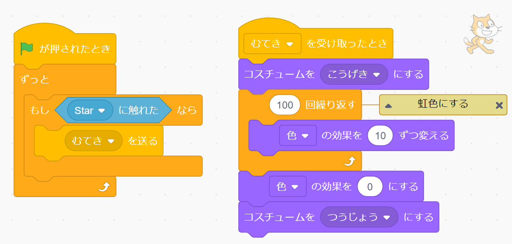

## 他の人に自分の作品を見せよう
一人ずつ、自分の作品を紹介しましょう。どんなところを工夫したか、なにがまだできていないのかなどを説明してください。

## 次回

次回は **シューティングゲーム** を作ります！　iPadの充電を忘れずにして、来てください。