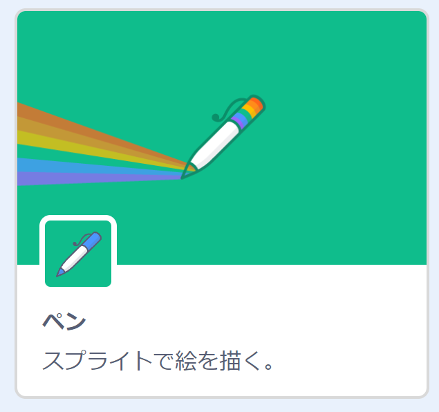
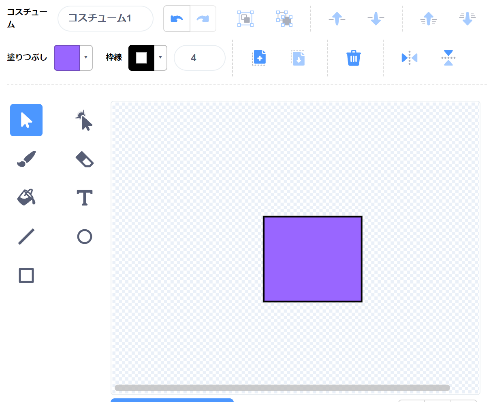

# プログラミング教室 拡張機能を使ってみよう

このプリントは、教室中に説明しなかった「拡張機能」を紹介する発展プリントです。
興味がある人は各自でやってみてください（やらなくてもOKです）。
もしわからないところがあれば、教室の時間中に遠慮なく質問してください。

## 拡張機能

左下のボタンをクリックすると、「拡張機能」で追加のブロックを使うことができます。

## 音楽ブロック

---

## 曲を演奏する

音楽ブロックを使うと、楽譜をもとに曲を演奏することができる。
きらきら星を演奏してみよう。

## 音を活用したゲームを作る

「ネコをタッチ（クリック）するとスコアが増える」「スコアが増えるほど、タッチしたときの音が高くなる」ゲームを作ってみよう。

---

## スタンプ・ペン

## 陣取りゲームを作る

お互いに画面を塗っていって、より多い面積を塗ったほうが勝つ、陣取りゲームを作ってみよう。

### 塗りつぶすプレイヤー

#### スプライト（例：タコ  ）を追加する。

#### コスチュームを追加して、塗る形を描く。名前を「ぬり」にする。

---

#### プログラムを作る

#### 旗をクリックして、「←」「↓」「↑」「→」キーで移動、スペースキーで塗りつぶしができることを確認する。

---

### 敵（ランダムに塗りつぶしてくる）

#### スプライト（例：サメ  ）を追加する

#### プログラムを作る

#### 旗をクリックして、敵がランダムに塗りつぶしてくることを確認する。

---

### 塗られた数を調べる

#### 小さな四角のスプライトを描く。 

#### プログラムを作る

#### 旗をクリックして、「赤」の数と「青」の数がカウントされることを確認する。

---

### 時間計測・結果発表をする

#### スプライト（例：ネコ  ）を追加する

#### プログラムを作る

#### 旗をクリックして、自分の色が多いときは「勝ち」、敵の色が多いときは「負け」が表示されるか確認する。

#### 完成！

