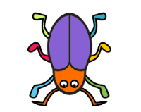

# プログラミング教室 第 4 回 シューティングゲームをつくろう

## 心得

1. どうなるかわからないときは、たくさん試してみよう！ たくさん失敗しよう！
2. マネするだけではなく、「どうして動く？」や「変えてみたらどうなる？」を考えよう！
3. わからないことがあるときは、周りの友達や、スタッフさんに質問しよう！

##  シューティングゲームを作ろう

小さく分けて考える

- プレイヤーを「←」「→」（矢印キー）で動かす
- 「スペースキー」でビームを出す。
- 画面の上の方に、敵がたくさん並ぶ。
- ビームが敵に当たると敵が消える。

---

## 復習 xy座標

座標（ざひょう）とは、画面の中の場所を、数字で表す方法のことです。 
横（よこ）の位置を x（エックス）座標、縦（たて）の位置を y（ワイ）座標で表します。

## プレイヤーを操作する

#### プレイヤーのスプライト（例：チョウチョ  ）を追加する。

#### プレイヤーをキーボードで動かせるようにプログラムする。

####  をクリックして、キーボードでプレイヤーを操作できることを確認する。

## 発展　移動スピードを変えてみよう

大事なところを見つけ出す 動くスピードを速くしたり遅くしたりしてみよう。

---

## 復習 クローン

クローンは、分身をつくる機能で、おなじスプライトをたくさん表示させたいときに使います。

## ビームを出す

#### ビームのスプライトを描く。

#### ちょうどいい大きさに変える。

---

#### 頭の中で動かしてみる プログラムをシミュレーションする。

#### ビームをプログラムして、スペースキーで発射されるようにする。

####  をクリックして、スペースキーを押すとビームが出るか確認する。
ビームが真ん中から発射されないときは、スプライトがまんなかにあるか確認しよう。

<!-- ## 発展 連射スピードを変えてみよう -->
<!-- ここに入れたかったが、紙面の都合上カット -->

---

## 敵を並べる

#### 頭の中で動かしてみる プログラムをシミュレーションする。

---

### プログラムを作る

#### 敵のスプライト（例：虫  ）を追加する。

#### 下を向くように、スプライトの「向き」を変更する。

#### プログラムを作る。

####  をクリックして、「敵が出てくること」「ビームに当たったら消えること」をたしかめる。

## 発展 敵の数・並べ方を変えてみよう

たとえば、次のようにするにはどうすればいいだろう？

- 列の数を増やして、5列にする
- 縦の間隔を広くする

---

## 発展 敵を動かそう
敵のプログラムに、動かすプログラムを追加しよう（今あるプログラムはそのまま）。

## 発展 敵を倒したらビームが消えるようにしよう
1 つのビームで 2 体の敵が倒せてしまう。
ビームのプログラムを改良して、敵に当たったら消えるようにしよう。

※「0.01秒待つ」がないと、敵にビームが当たったことを判定する前にビームが消えてしまい、敵が消えなくなってしまう。

---

## 背景を設定する

**完成！**

##  つくったプログラムを保存しよう
プログラムを保存します。

## 改良のヒント

- 残りの敵の数を数えて、全部倒したらクリア画面を表示する
- 全部倒したら、次のステージに進んで、もっとたくさんの敵が出てくる
- 敵からもビームを出す
- 連射の間隔を変える
- クリアタイムを計測する
- キャラクターや背景を変更する

<!-- 「ステージ切り替え」というテクを入れてもいいかもしれない -->

## 他の人に自分の作品を見せよう
一人ずつ、自分の作品を紹介しましょう。どんなところを工夫したか、なにがまだできていないのかなどを説明してください。

## 次回

次回は **自分のゲーム** を作ります！　
ゲームを作る際の参考にするため、 **これまでのプリント** も持ってくるようにしましょう。
**iPad**の充電を忘れずにして、来てください。

---

## 切り取り用

頭の中で動かしてみる で、キャラクターの動きをシミュレーションするときに使います。

<!-- TODO: ビームと虫のカードを入れる -->

<table style="margin: auto;">
<tr>
<td style="border: 1px solid black;"></td>
<td style="border: 1px solid black;"></td>
<td style="border: 1px solid black;"></td>
<td style="border: 1px solid black;"></td>
<td style="border: 1px solid black;"></td>
</tr>
<tr>
<td style="border: 1px solid black;"></td>
<td style="border: 1px solid black;"></td>
<td style="border: 1px solid black;"></td>
<td style="border: 1px solid black;"></td>
<td style="border: 1px solid black;"></td>
</tr>
<tr>
<td style="border: 1px solid black;"></td>
<td style="border: 1px solid black;"></td>
<td style="border: 1px solid black;"></td>
<td style="border: 1px solid black;"></td>
<td style="border: 1px solid black;"></td>
</tr>
</table>