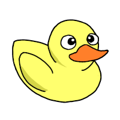
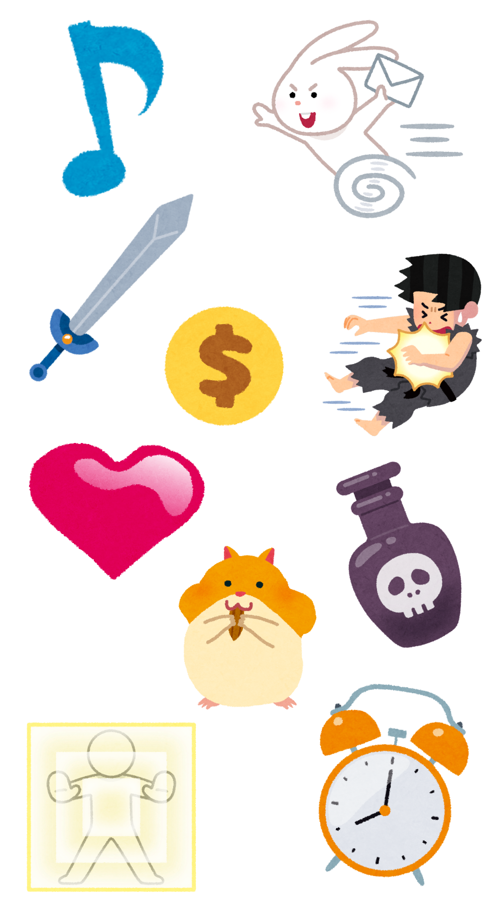

# プログラミング教室 第 5 回 自分のゲームを作ろう

## 自分のゲームを作ろう

### 1. まずは、どんなゲームを作りたいか考えてみよう

**これまでに作ったゲームを改良** して作るのはもちろん、 **全く新しいゲーム** を作ってもOK。

### 2. 小さく分けて考える 作りたいものを分解しよう

作りたいゲームに必要な要素を分解してみよう。
たとえば、 **マリオみたいなゲーム** を作りたいとしたら、次のようなものが必要。

- マリオを操作できるようにする
  - 歩かせる
  - ジャンプさせる
- クリボーを表示する
- マリオがクリボーにあたったらダメージを受けたり、ゲームオーバーにしたりする
- ゴールに着いたらクリアする
- 制限時間をつける
  - 時間を計測する
  - 時間が0になったらゲームオーバーにする

どんなことをしたいか、分解しながら書いてみよう!

---

### 3. 大事なところを見つけ出す これまでに作ったゲームから似ているところを見つけ出して参考にしよう

作りたいゲームと全く同じものはなくても、細かく分けてみたら参考にできるところはある。
例えば、「時間を計測する」なら、第2回のくだもの拾いゲームで作ったプログラムが使えそうだ。

共通点を探そう

### 4. 頭の中で動かしてみる 作ってみてうまくいかないときは、頭の中で動かしてみる

コンピューターは、プログラムに書かれた通りのことしか実行しない。
つまり、思った通りに動かないときは、プログラムが間違っているはず。
間違えているところを探すには、 **頭の中で動かしてみる（シミュレーションする）** のが一番。
シミュレーションしてみると、思った通りにできていないところが見つかるはず。

プログラムを口に出して読み上げると、ミスに気づけることも！

<!-- 
### 5. 直すために 大事なところを見つけ出す

進む速さを変えたいぞ。
この中で、進む速さを決めているのはどこだろう？
旗が押されたら、・・・進む動きには関係なさそう
10歩進む・・・ここで動くんだから、この歩数を変えたらいいんじゃないか？

 -->

## 作るものに困ったときのアイデア

- 攻撃したとき・ダメージを受けたときなどに **演出** を加える
  - **音（効果音・BGM）** を足す
  - **アニメーション（動き）** を足す
  - **見た目を変える**
- **スコア** や **HP** をカウントする
- **制限時間** をつける
- クリアしたときに **クリア画面**を表示する
- 失敗したときに **ゲームオーバー画面**を表示する
- **敵** を増やす・強くする
- **アイテム** を増やす
  - 強くなるアイテム・弱くなるアイテム
  - ダメージを受けるアイテム・回復するアイテム

## 次回

次回はついに **発表会** です！　iPadの充電を忘れずにして、来てください。
