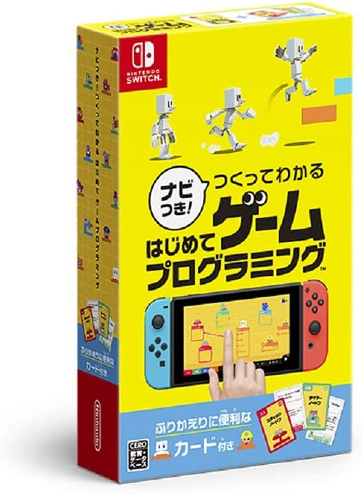
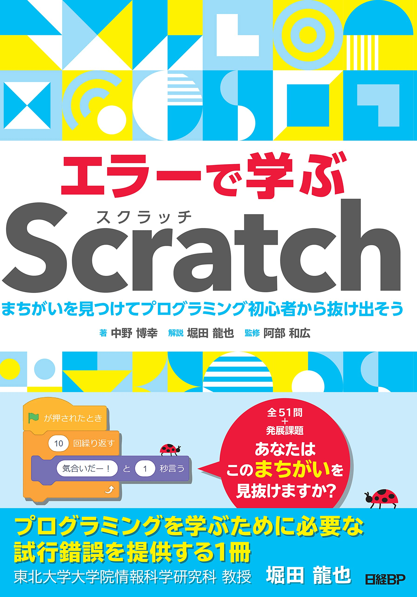

# プログラミング教室 第 6 回 発表会

2022年 12月 10日 岸 嘉丸

## 発表会

### 発表会

1. 番号順に一人ずつ前に出て発表します。
2. 自分の作ったゲームを映します。
3. 次のことを質問します。説明は、みんなに向かって大きな声で話してください。
   - どんな作品か（なにをするゲーム？ それとも音楽やアニメーション？）
   - 工夫したところ
4. 一つ前の発表者に、ゲームを遊んでもらいます。
5. 発表を聞いた人たちや、他のスタッフさんから質問をします。
6. 発表が終わったら、次の人のゲームを遊ぶ人になります。

### 感想

1. 聞いている人たちは、指定された人に向けて感想を書きます。
発表を聞きながら、すごいと思ったところを書きましょう。
2. 感想はまとめて本人に渡します。

## もっと知りたいときのおすすめ

### 他のプログラミングをやってみたい！
Nintendo Switch **『ナビつき！ つくってわかる　はじめてゲームプログラミング』**
https://www.nintendo.co.jp/switch/awuxa/

### Scratch のレベルアップを目指したい！
日経BP **『エラーで学ぶScratch まちがいを見つけてプログラミング初心者から抜け出そう』**
https://www.amazon.co.jp/dp/4296070436

