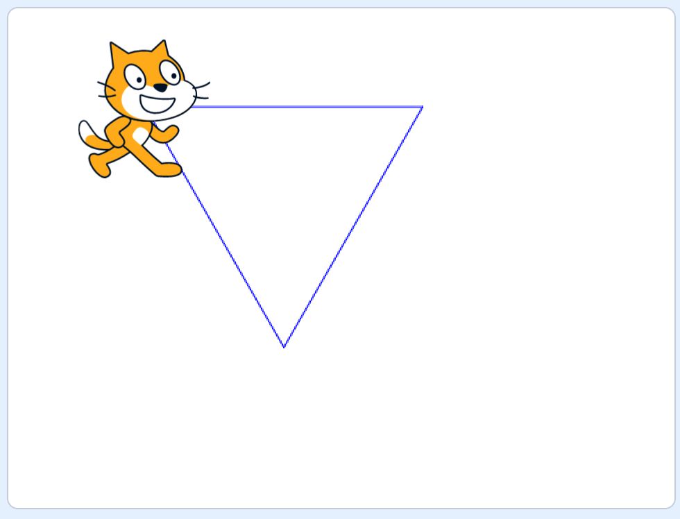

## おまけ・プログラミングクイズ

拡張機能の「ペン」の機能を使うと、スプライト（キャラクター）が動いた跡が線になる。
これを使って図形を描くことができる。

### 例題：四角形を描くプログラム

例えば次のようなプログラムを実行すると、四角形（正方形）が描ける。

  

    <strong>プログラム</strong> 
    
  

  

    <!-- <strong>予想</strong> 
     -->
  

  

    <strong>結果</strong> 
    
  

### 第1問 「200歩」に変えたらどうなる？

  

    <strong>プログラム</strong> 
    
  

  

    <strong>予想</strong> 
    
  

  

    <strong>結果</strong> 
    
  

---

### 第2問 「3回繰り返す」にしたらどうなる？

  

    <strong>プログラム</strong> 
    
  

  

    <strong>予想</strong> 
    
  

  

    <strong>結果</strong> 
    
  

### 第3問 「45度」にしたらどうなる？

  

    <strong>プログラム</strong> 
    
  

  

    <strong>予想</strong> 
    
  

  

    <strong>結果</strong> 
    
  

### 第4問 「正三角形」をつくるにはどうしたらいい？

この問題は、プログラムの中の

  

    <strong>目標</strong> 
    
  

  

    <strong>プログラム</strong> 
    
  

  

    <!-- <strong>予想</strong> 
     -->
  

